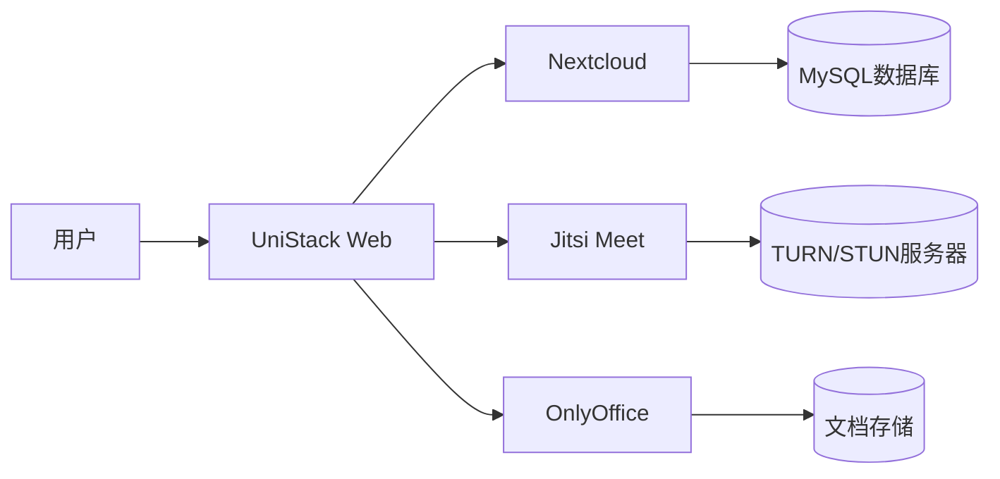

# **UniStack 一体化协作平台**  

**UniStack** 是一个基于 **Nextcloud（用户管理）+ Jitsi（视频会议）+ OnlyOffice（文档协作）** 的 **开源、自托管** 团队协作系统，提供 **统一入口** 管理文件、会议和在线文档编辑。  

---

## **🚀 核心功能**
| 模块          | 功能描述                                                                 |
|---------------|--------------------------------------------------------------------------|
| **📂 文件管理** | 基于 Nextcloud 的云端存储，支持文件同步、共享、版本控制。                |
| **📝 文档协作** | 集成 OnlyOffice，支持多人实时编辑 **Word/Excel/PPT**，完美兼容 Office 格式。 |
| **🎥 视频会议** | 通过 Jitsi Meet 提供高清视频通话、屏幕共享、会议录制（无需账号直接加入）。 |
| **👥 用户管理** | 团队权限控制、分组管理、SSO（可选 LDAP/OAuth2 集成）。                    |
| **📅 日程预约** | Nextcloud 日历集成，可预订会议并自动生成 Jitsi 房间链接。                |

---

## **🛠 技术架构**


- **前端访问**：Nginx 统一代理，支持 HTTPS。  
- **后端服务**：Docker 容器化部署，扩展灵活。  
- **数据存储**：文件、数据库、会议信令分离，确保稳定性。  

---

## **⚡ 快速部署**
### **1. 环境要求**
- **服务器**：Linux (推荐 Ubuntu 22.04)  
- **配置**：4核 CPU / 8GB RAM / 100GB SSD（20人团队基准）  
- **依赖**：Docker + Docker Compose  

### **2. 一键启动**
```bash
git clone https://github.com/your-repo/unistack
cd unistack
docker-compose up -d
```
访问 `https://your-domain.com` 完成初始化配置。  

---

## **🔧 配置说明**
| 组件          | 默认访问地址               | 配置文件位置               |
|---------------|--------------------------|--------------------------|
| Nextcloud     | `https://域名/cloud`     | `./nextcloud/config`     |
| Jitsi Meet    | `https://域名/meet`      | `./jitsi/web/config`     |
| OnlyOffice    | `https://域名/office`    | `./onlyoffice/data`      |
| Nginx         | `https://域名`           | `./nginx/conf.d`         |

---

## **📈 适用场景**
- **远程办公团队**：统一管理文档、会议、文件。  
- **教育机构**：在线课堂 + 协作笔记 + 作业提交。  
- **开源社区**：安全可控的私有化协作平台。  

---

## **📜 开源协议**
- **核心组件**：AGPLv3 (Nextcloud/Jitsi) + ONLYOFFICE 社区版协议  
- **项目代码**：MIT License (UniStack 集成层)  

---

## **📌 后续计划**
- ✅ **移动端优化**：适配 Nextcloud/Jitsi 官方 App  
- ✅ **企业集成**：支持 LDAP/OAuth2 登录  
- ✅ **性能监控**：Prometheus + Grafana 仪表盘  

---

**🎯 目标**：让团队协作 **更简单、更安全、更高效**。  
**🔗 立即体验**：[https://unistack.demo.com](https://unistack.demo.com)  

--- 

需要调整功能细节或扩展集成？欢迎提交 Issue 或 PR！ 🚀
